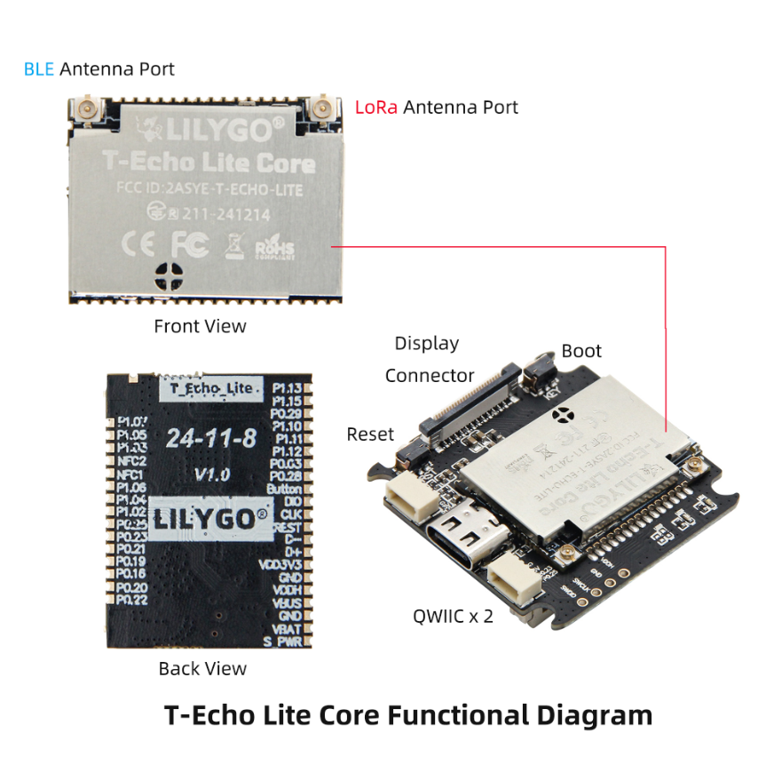

<!--
 * @Description: None
 * @Author: LILYGO_L
 * @Date: 2023-09-11 16:13:14
 * @LastEditTime: 2025-10-30 16:32:48
 * @License: GPL 3.0
-->
<h1 align = "center">T-Echo-Lite</h1>

    

## **English | [中文](./README_CN.md)**

## Version iteration:
| Version                              | Update date                       |
| :-------------------------------: | :-------------------------------: |
| T-Echo-Lite_V1.0            | 2024-12-06                         |
| T-Echo-Lite-KeyShield_V1.0            | 2025-10-14                         |

## PurchaseLink
| Product                     | SOC           |  FLASH  |  PSRAM   | Link                   |
| :------------------------: | :-----------: |:-------: | :---------: | :------------------: |
| T-Echo-Lite_V1.0   | nRF52840 |   1M   |256kB| [LILYGO Mall](https://lilygo.cc/products/t-echo-lite?_pos=1&_sid=79b4c08e7&_ss=r&variant=45331277906101) |
| T-Echo-Lite-KeyShield_V1.0   |  |  || NULL |

## Directory
- [Describe](#describe)
- [Preview](#preview)
- [Module](#module)
- [SoftwareDeployment](#SoftwareDeployment)
- [PinOverview](#pinoverview)
- [RelatedTests](#RelatedTests)
- [FAQ](#faq)
- [Project](#project)

## Describe

T-Echo-Lite is a lightweight version based on T-Echo, featuring a smaller volume and lower power consumption design compared to T-Echo. Its minimum deep sleep power consumption can reach 2μA to 10μA (due to differences in onboard components on different boards, power consumption performance may vary; the minimum power consumption mentioned here is based on the engineering board tested by the LILYGO laboratory). The board is equipped with a rich set of features, including an inertial sensor, LORA module, solar charging function (5V), external GPS, and more. Its excellent power consumption performance allows T-Echo-Lite to achieve superior battery life.

T-Echo-Lite-KeyShield is a baseboard expansion for T-Echo-Lite, primarily extending peripherals such as a keyboard, speaker, microphone, and vibration motor.

## Preview

### Actual Product Image

    

---

    

---

    

## Module

### T-Echo-Lite Section
### 1. MCU
*   Chip: nRF52840
*   RAM: 256kB
*   FLASH: 1M
*   Related Documentation:
    > [nRF52840_Datasheet](https://docs.nordicsemi.com/bundle/ps_nrf52840/page/keyfeatures_html5.html)

### 2. Screen
*   Name: GDEM0122T61
*   Size: 1.22 inches
*   Resolution: 176x192px
*   Screen Type: E-PAPER
*   Driver Chip: SSD1681
*   Bus Communication Protocol: IIC
*   Additional Notes: Fast refresh is not supported (after consulting the screen manufacturer, they replied that it is not supported), it is recommended to use full refresh only
*   Dependent Libraries:
    >[Adafruit_EPD](https://github.com/adafruit/Adafruit_EPD)  
    >[Adafruit_BusIO](https://github.com/adafruit/Adafruit_BusIO)  
    >[Adafruit_SPIFlash](https://github.com/adafruit/Adafruit_SPIFlash)  
    >[Adafruit-GFX-Library](https://github.com/adafruit/Adafruit-GFX-Library)
*   Related Documentation:
    > [GDEM0122T61](./information/GDEM0122T61.pdf)  
    > [SSD1681](./information/SSD1681.pdf)  

### 3. LORA
*   Chip Module: S62F
*   Chip: SX1262
*   Bus Communication Protocol: SPI
*   Dependent Libraries:
    >[RadioLib](https://github.com/jgromes/RadioLib)  
    >[Adafruit_BusIO](https://github.com/adafruit/Adafruit_BusIO)  
    >[Adafruit_SPIFlash](https://github.com/adafruit/Adafruit_SPIFlash)
*   Related Documentation:
    > [S62F](./information/S62F.pdf)  

### 4. GPS
*   Chip Module: L76K
*   Bus Communication Protocol: UART
*   Dependent Libraries:
    >[TinyGPSPlus](https://github.com/mikalhart/TinyGPSPlus)
*   Related Documentation:
    > [L76KB-A58](./information/L76KB-A58.pdf)  

### 5. Inertial Measurement Unit
*   Chip: ICM20948
*   Bus Communication Protocol: IIC
*   Dependent Libraries:
    >[ICM20948_WE](https://github.com/wollewald/ICM20948_WE)
*   Related Documentation:
    > [ICM20948](./information/ICM20948.pdf)  

### 6. Flash
*   Chip: ZD25WQ32CEIGR
*   Bus Communication Protocol: SPI
*   Dependent Libraries:
    >[Adafruit_BusIO](https://github.com/adafruit/Adafruit_BusIO)  
    >[Adafruit_SPIFlash](https://github.com/adafruit/Adafruit_SPIFlash)  
*   Related Documentation:
    > [ZD25WQ32CEIGR](./information/ZD25WQ32CEIGR.pdf)

### T-Echo-Lite-KeyShield Section
### 1. Keyboard Backlight

* Driver Chip: AW21009QNR
* Bus Communication Protocol: IIC
* Dependent Libraries:
    >[cpp_bus_driver](https://github.com/Llgok/cpp_bus_driver)
* Related Information:
    >[AW21009QNR](./information/AW21009QNR.pdf)

### 2. Vibration

* Driver Chip: AW86224
* Bus Communication Protocol: IIC
* Dependent Libraries:
    >[cpp_bus_driver](https://github.com/Llgok/cpp_bus_driver)
* Related Information:
    >[AW86224AFCR](./information/AW86224AFCR.pdf)

### 3. Speaker Microphone

* Driver Chip: ES8311
* Bus Communication Protocols: IIC, IIS
* Dependent Libraries:
    >[cpp_bus_driver](https://github.com/Llgok/cpp_bus_driver)
* Related Information:
    >[ES8311](./information/ES8311.pdf)

### 4. Keyboard

* Driver Chip: TCA8418
* Bus Communication Protocol: IIC
* Dependent Libraries:
    >[cpp_bus_driver](https://github.com/Llgok/cpp_bus_driver)
* Related Information:
    >[tca8418](./information/tca8418.pdf)

## SoftwareDeployment

### Examples Support

### T-Echo-Lite Examples
| Example | `[Arduino IDE (Adafruit_nRF52_V1.6.1)]`   `[PlatformIO (nordicnrf52_V10.6.0)]`   Support | Description | Picture |
| ------  | ------  | ------ | ------ | 
| [Battery_Measurement](./examples/T-Echo-Lite/Battery_Measurement) | 
![alt text][supported]  |  |  |
| [BLE_Uart](./examples/T-Echo-Lite/BLE_Uart) | 
![alt text][supported]  |  |  |
| [Button_Triggered](./examples/T-Echo-Lite/Button_Triggered) | 
![alt text][supported]  |  |  |
| [Display](./examples/T-Echo-Lite/Display) | 
![alt text][supported]  |  |  |
| [Display_BLE_Uart](./examples/T-Echo-Lite/Display_BLE_Uart) | 
![alt text][supported]  |  |  |
| [Display_SX1262](./examples/T-Echo-Lite/Display_SX1262) | 
![alt text][supported]  |  |  |
| [Flash](./examples/T-Echo-Lite/Flash) | 
![alt text][supported]  |  |  |
| [Flash_Erase](./examples/T-Echo-Lite/Flash_Erase) | 
![alt text][supported]  |  |  |
| [Flash_Speed_Test](./examples/T-Echo-Lite/Flash_Speed_Test) | 
![alt text][supported]  |  |  |
| [GPS](./examples/T-Echo-Lite/GPS) | 
![alt text][supported]  |  |  |
| [GPS_Full](./examples/T-Echo-Lite/GPS_Full) | 
![alt text][supported]  |  |  |
| [ICM20948](./examples/T-Echo-Lite/ICM20948) | 
![alt text][supported]  |  |  |
| [IIC_Scan_2](./examples/T-Echo-Lite/IIC_Scan_2) | 
![alt text][supported]  |  |  |
| [nrf52840_module](./examples/T-Echo-Lite/nrf52840_module) | 
![alt text][supported]  |  |  |
| [Original_Test](./examples/T-Echo-Lite/Original_Test) |
![alt text][supported]  | Product factory original testing |  |
| [Sleep_Wake_Up](./examples/T-Echo-Lite/Sleep_Wake_Up) | 
![alt text][supported]  |  |  |
| [SX126x_PingPong](./examples/T-Echo-Lite/SX126x_PingPong) | 
![alt text][supported]  |  |  |
| [SX126x_PingPong_2](./examples/T-Echo-Lite/SX126x_PingPong_2) | 
![alt text][supported]  |  |  |
| [sx126x_tx_continuous_wave](./examples/T-Echo-Lite/sx126x_tx_continuous_wave) | 
![alt text][supported]  |  |  |

### T-Echo-Lite-KeyShield Examples
| Example | `[Arduino IDE (Adafruit_nRF52_V1.6.1)]`   `[PlatformIO (nordicnrf52_V10.6.0)]`   Support | Description | Picture |
| ------  | ------  | ------ | ------ | 
| [aw21009qnr](./examples/T-Echo-Lite-KeyShield/aw21009qnr) | 
![alt text][supported]  |  |  |
| [aw86224](./examples/T-Echo-Lite-KeyShield/aw86224) | 
![alt text][supported]  |  |  |
| [es8311](./examples/T-Echo-Lite-KeyShield/es8311) | 
![alt text][supported]  |  |  |
| [original_test](./examples/T-Echo-Lite-KeyShield/original_test) | 
![alt text][supported]  | Product factory original testing  |  |
| [tca8418](./examples/T-Echo-Lite-KeyShield/tca8418) | 
![alt text][supported]  |  |  |
| [voice_speaker](./examples/T-Echo-Lite-KeyShield/voice_speaker) | 
![alt text][supported]  |  |  |

[supported]: https://img.shields.io/badge/-supported-green "example"

| Bootloader | Description | Picture |
| ------  | ------  | ------ |
| [bootloader](./bootloader/) | |  |

| Firmware | Description | Picture |
| ------  | ------  | ------ |
| [T-Echo-Lite_Original_Test(lora_868mhz_125khz)](./firmware/[T-Echo-Lite_V1.0][Original_Test(lora_868mhz_125khz)]_firmware/)| Product factory original testing |  |
| [T-Echo-Lite_Original_Test(lora_915mhz_125khz)](./firmware/[T-Echo-Lite_V1.0][Original_Test(lora_915mhz_125khz)]_firmware/)| Product factory original testing |  |
| [T-Echo-Lite-KeyShield_original_test](./firmware/[T-Echo-Lite-KeyShield_V1.0][original_test]_firmware/)| Product factory original testing |  |

### IDE and Flashing

#### PlatformIO
1. Install [VisualStudioCode](https://code.visualstudio.com/Download),choose installation based on your system type.

2. Open the "Extension" section of the Visual Studio Code software sidebar (Alternatively, use "<kbd>Ctrl</kbd>+<kbd>Shift</kbd>+<kbd>X</kbd>" to open the extension). Search for the "PlatformIO IDE" extension and download it.

3. During the installation of the extension, you can go to GitHub to download the program. You can download the main branch by clicking on the "<> Code" with green text, or you can download the program versions from the "Releases" section in the sidebar.

4. After the installation of the extension is completed, open the Explorer in the sidebar (Alternatively, use "<kbd>Ctrl</kbd>+<kbd>Shift</kbd>+<kbd>E</kbd>" go open it). Click on "Open Folder", locate the project code you just downloaded (the entire folder), and click "Add." At this point, the project files will be added to your workspace.

5. Open the "platformio.ini" file in the project folder (PlatformIO will automatically open the "platformio.ini" file corresponding to the added folder). Under the "[platformio]" section, uncomment and select the example program you want to burn (it should start with "default_envs = xxx") Then click "<kbd>[√](image/4.png)</kbd>" in the bottom left corner to compile. If the compilation is correct, connect the microcontroller to the computer and click "<kbd>[→](image/5.png)</kbd>" in the bottom left corner to download the program.

6. At this point, an error may occur, and you need to install [Python](https://www.python.org/downloads/). Open the folder "tool" -> "win10 vscode platformio start" sequentially, and execute the cmd command `python t-echo-lite_v1.0.0_setup.py` under the "win10 vscode platformio start" folder. This will complete the development board installation, and the compilation and flashing will no longer report errors.

#### Arduino

1. Install [Arduino](https://www.arduino.cc/en/software), and select the installation based on your system type.

2. Open the "example" directory of the project folder, select the example project folder, and open the file ending with ".ino" to open the Arduino IDE project workspace.

3. Open the "Tools" menu bar at the top right -> Select "Board" -> "Board Manager", find or search for "Adafruit_nRF52", and download the board file with the author named "Adafruit". Then return to the "Board" menu bar, select the board type under the "Adafruit_nRF52" board, and the selected board type is determined by the "board = xxx" header under the [env] directory in the "platformio.ini" file. If there is no corresponding board, you need to manually add the board under the "board" directory in the project folder. (If "Adafruit_nRF52" cannot be found, you need to open Preferences -> Add `https://www.adafruit.com/package_adafruit_index.json` to "Additional Board Manager URLs")
    
4. Open the menu bar "[File](image/6.png)" -> "[Preferences](image/6.png)", find the "[Project Folder Location](image/7.png)" section, and copy and paste all the library files along with the folders in the "libraries" folder under the project directory into the "libraries" folder in this directory.
    
5. Select the correct settings in the "Tools" menu, as shown in the table below.
    
| Setting                               | Value                                 |
| :-------------------------------: | :-------------------------------: |
| Board                                 | Nordic nRF52840 DK           |

6.  Select the correct port.

7.  Enable boot download mode: Press and release the RST chip reset button, wait for LED1 to light up (you must wait for LED1 to light up), then press and release the RST button again. Observe that LED1 gradually dims and then gradually lights up, indicating that the boot download mode has been entered.

8.  Click the top right "[√](image/8.png)" to compile. If there are no errors, connect the microcontroller to the computer and click the top right "[→](image/9.png)" to start the flashing process.

#### JLINK Flashing Firmware and Bootloader

1.  Install the software [nRF-Connect-for-Desktop](https://www.nordicsemi.com/Products/Development-tools/nRF-Connect-for-Desktop/Download#infotabs)

2.  Install the software [JLINK](https://www.segger.com/downloads/jlink/)

3.  Connect the JLINK pins correctly as shown in the figure below

    

4.  Open the software nRF-Connect-for-Desktop and install the tool [Programmer](./image/10.png) and open it

5.  Add files, select both the bootloader file and the firmware file at the same time, click [Erase&write](./image/11.png), and the flashing will be completed.

## PinOverview

For pin definitions, please refer to the configuration file: 
 

[t_echo_lite_config.h](./libraries/private_library/t_echo_lite_config.h)  
[t_echo_lite_keyshield_config.h](./libraries/private_library/t_echo_lite_keyshield_config.h)

## RelatedTests

### Power Dissipation
| Firmware | Program| Description | Picture |
| ------  | ------  | ------ | ------ | 
| [Sleep_Wake_Up](./firmware/[T-Echo-Lite_V1.0][Sleep_Wake_Up]_firmware/[T-Echo-Lite_V1.0][Sleep_Wake_Up]_firmware_202412040900.hex)   [Sleep_Wake_Up(uf2)](./firmware/[T-Echo-Lite_V1.0][Sleep_Wake_Up]_firmware/[T-Echo-Lite_V1.0][Sleep_Wake_Up]_firmware_202412040900.uf2) | `Sleep_Wake_Up` | Minimum power consumption: 2.54uA   More information can be found in the [Power Consumption Test Log](./relevant_test/PowerConsumptionTestLog_[T-Echo-Lite_V1.0]_20241210.pdf) | 
  
 |

## FAQ

* Q. After reading the above tutorials, I still don't know how to build a programming environment. What should I do?
* A. If you still don't understand how to build an environment after reading the above tutorials, you can refer to the [LilyGo-Document](https://github.com/Xinyuan-LilyGO/LilyGo-Document) document instructions to build it.

 

* Q. Why does Arduino IDE prompt me to update library files when I open it? Should I update them or not?
* A. Choose not to update library files. Different versions of library files may not be mutually compatible, so it is not recommended to update library files.

 

* Q. Why is there no debug information output from my board's USB?
* A. Please enable the "DTR" option in your serial assistant software.

 

* Q. Why does my board fail to flash when I use USB directly?
* A. Please press and release the RST chip reset button, wait for LED1 to light up (you must wait for LED1 to light up), then press and release the RST button again. Observe that LED1 gradually dims and then gradually lights up, indicating that the boot download mode has been entered. At this point, you can flash the board.

 

* Q. How should the Bluetooth antenna and Lora antenna of the T-Echo-Lite module be distinguished?
* A. The Bluetooth antenna and Lora antenna of the T-Echo-Lite module are as shown in the following figure:

    

 

## Project
* [T-Echo-Lite_V1.0](./project/T-Echo-Lite_V1.0/T-Echo-Lite_V1.0.pdf)
* [T-Echo-Lite-Eapper_V1.0](./project/T-Echo-Lite_V1.0/T-Echo-Lite-Eapper_V1.0.pdf)
