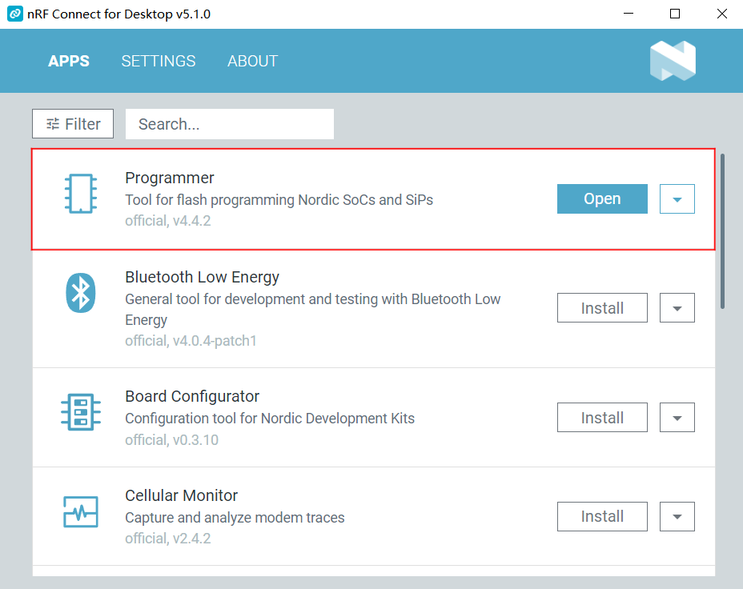
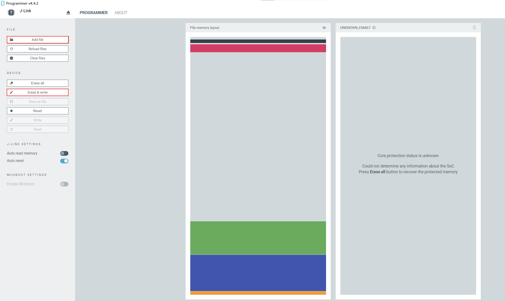

<!--
 * @Description: None
 * @Author: LILYGO_L
 * @Date: 2023-09-11 16:13:14
 * @LastEditTime: 2024-12-06 11:47:44
 * @License: GPL 3.0
-->

<h1 align = "center">T-Echo-Lite</h1>

    

## **[English](./README.md) | 中文**

## 版本迭代:
| Version                               | Update date                       |
| :-------------------------------: | :-------------------------------: |
| T-Echo-Lite_V1.0            | 2024-12-06                         |

## 购买链接
| Product                     | SOC           |  FLASH  |  PSRAM   | Link                   |
| :------------------------: | :-----------: |:-------: | :---------: | :------------------: |
| T-Echo-Lite_V1.0   | ESP32S3R8 |   16M   |8M (Octal SPI)| NULL |

## 目录
- [描述](#描述)
- [预览](#预览)
- [模块](#模块)
- [快速开始](#快速开始)
- [引脚总览](#引脚总览)
- [常见问题](#常见问题)
- [项目](#项目)

## 描述

T-Echo-Lite是基于T-Echo的轻便版本，拥有比T-Echo更小的体积，更小的功耗设计，最低深度睡眠功耗可达2μA-10μA（不同板子由于板载元器件差异功耗的表现可能不同，这里最低功耗采用LILYGO实验室测定的工程板），板载丰富的功能，惯性传感器、LORA模块、太阳能充电功能（5V）、外置GPS等功能，及其优秀的功耗表现使得T-Echo-Lite能够拥有更为出色的续航。

## 预览

### 实物图

<!-- 

    

 -->

---

<!-- 

    

 -->

---

<!-- 

    

 -->

## 模块

### 1. MCU

* 芯片：nRF52840
* RAM：256kB
* FLASH：1M
* 相关资料：更多资料请访问 [NORDIC官方nRF52840数据手册](https://docs.nordicsemi.com/bundle/ps_nrf52840/page/keyfeatures_html5.html)

### 2. 屏幕

* 名称：GDEM0122T61
* 尺寸：1.22 英寸
* 屏幕类型：E-PAPER
* 驱动芯片：SSD1681
* 总线通信协议：QSPI
* 其他说明：不支持快刷（咨询屏厂后他们回复不支持），建议只使用全刷
* 依赖库：
    >[Adafruit_BusIO-1.16.1](./libraries/Adafruit_BusIO-1.16.1/)   
    >[Adafruit_EPD-4.5.5](./libraries/Adafruit_EPD-4.5.5/)
   >[Adafruit_SPIFlash-4.3.4](./libraries/Adafruit_SPIFlash-4.3.4/)
* 相关资料：
    * [DXQ120MYB2416A](./information/DXQ120MYB2416A.pdf)

### 3. 触摸

* 芯片：CHSC5816
* 总线通信协议：IIC

### 4. 旋转编码器

* 特性：支持左右旋转

### 5. 蜂鸣器

## 快速开始

### 例程支持

| Example | Support IDE And Version| Description | Picture |
| ------  | ------  | ------ | ------ | 
| [GFX](./examples/GFX) | `[Arduino IDE][esp32_v3.0.7]` |  |  |
| [Lvgl_CIT](./examples/Lvgl_CIT) |`[Arduino IDE][esp32_v3.0.7]` | Product factory original testing |  |
| [CHSC5816](./examples/CHSC5816) | `[Arduino IDE][esp32_v3.0.7]` |  |  |
| [Rotary_Encoder](./examples/Rotary_Encoder) | `[Arduino IDE][esp32_v3.0.7]` |  |  |

| Firmware | Description | Picture |
| ------  | ------  | ------ |
| [Lvgl_CIT](./firmware/[T-Echo-Lite_V1.0][Lvgl_CIT]_firmware_V1.0.0.bin) | Original |  |

### PlatformIO
1. 安装[VisualStudioCode](https://code.visualstudio.com/Download)，根据你的系统类型选择安装。

2. 打开VisualStudioCode软件侧边栏的“扩展”（或者使用<kbd>Ctrl</kbd>+<kbd>Shift</kbd>+<kbd>X</kbd>打开扩展），搜索“PlatformIO IDE”扩展并下载。

3. 在安装扩展的期间，你可以前往GitHub下载程序，你可以通过点击带绿色字样的“<> Code”下载主分支程序，也通过侧边栏下载“Releases”版本程序。

4. 扩展安装完成后，打开侧边栏的资源管理器（或者使用<kbd>Ctrl</kbd>+<kbd>Shift</kbd>+<kbd>E</kbd>打开），点击“打开文件夹”，找到刚刚你下载的项目代码（整个文件夹），点击“添加”，此时项目文件就添加到你的工作区了。

5. 打开项目文件中的“platformio.ini”（添加文件夹成功后PlatformIO会自动打开对应文件夹的“platformio.ini”）,在“[platformio]”目录下取消注释选择你需要烧录的示例程序（以“default_envs = xxx”为标头），然后点击左下角的“<kbd>[√](image/4.png)</kbd>”进行编译，如果编译无误，将单片机连接电脑，点击左下角“<kbd>[→](image/5.png)</kbd>”即可进行烧录。

### Arduino
1. 安装[Arduino](https://www.arduino.cc/en/software)，根据你的系统类型选择安装。

2. 打开项目文件夹的“example”目录，选择示例项目文件夹，打开以“.ino”结尾的文件即可打开Arduino IDE项目工作区。

3. 打开右上角“工具”菜单栏->选择“开发板”->“开发板管理器”，找到或者搜索“esp32”，下载作者名为“Espressif Systems”的开发板文件。接着返回“开发板”菜单栏，选择“ESP32 Arduino”开发板下的开发板类型，选择的开发板类型由“platformio.ini”文件中以[env]目录下的“board = xxx”标头为准，如果没有对应的开发板，则需要自己手动添加项目文件夹下“board”目录下的开发板。

4. 打开菜单栏“[文件](image/6.png)”->“[首选项](image/6.png)”，找到“[项目文件夹位置](image/7.png)”这一栏，将项目目录下的“libraries”文件夹里的所有库文件连带文件夹复制粘贴到这个目录下的“libraries”里边。

5. 在 "工具 "菜单中选择正确的设置，如下表所示。

| Setting                               | Value                                 |
| :-------------------------------: | :-------------------------------: |
| Board                                | ESP32S3 Dev Module|
| Upload Speed                     | 921600                               |
| USB Mode                           | Hardware CDC and JTAG     |
| USB CDC On Boot                | Enabled                             |
| USB Firmware MSC On Boot | Disabled                             |
| USB DFU On Boot                | Disabled                             |
| CPU Frequency                   | 240MHz (WiFi)                    |
| Flash Mode                         | QIO 80MHz                         |
| Flash Size                           | 16MB (128Mb)                     |
| Core Debug Level                | None                                 |
| Partition Scheme                | 16M Flash (3MB APP/9.9MB FATFS) |
| PSRAM                                | OPI PSRAM                         |
| Arduino Runs On                  | Core 1                               |
| Events Run On                     | Core 1                               |

6. 选择正确的端口。

7. 点击右上角“<kbd>[√](image/8.png)</kbd>”进行编译，如果编译无误，将单片机连接电脑，点击右上角“<kbd>[→](image/9.png)</kbd>”即可进行烧录。

### firmware烧录
1. 打开项目文件“tools”找到ESP32烧录工具，打开。

2. 选择正确的烧录芯片以及烧录方式点击“OK”，如图所示根据步骤1->2->3->4->5即可烧录程序，如果烧录不成功，请按住“BOOT-0”键再下载烧录。

3. 烧录文件在项目文件根目录“[firmware](./firmware/)”文件下，里面有对firmware文件版本的说明，选择合适的版本下载即可。

    
    

## 引脚总览

| 屏幕引脚       | ESP32S3引脚      |
| :------------------: | :------------------:|
| SDIO0                     | IO11                  |
| SDIO1                     | IO13                  |
| SDIO2                     | IO7                  |
| SDIO3                     | IO14                  |
| SCLK                  | IO12                  |
| RST                    | IO4                  |
| VCI EN                | IO3                  |
| CS                    | IO10                  |

| 触摸引脚          | ESP32S3引脚      |
| :------------------: | :------------------:|
| RST                  | IO8                  |
| INT                  | IO9                    |
| SDA                  | IO5                  |
| SCL                  | IO6                  |

| 旋转编码器引脚          | ESP32S3引脚      |
| :------------------: | :------------------:|
| KNOB DATA A      | IO1                  |
| KNOB DATA B      | IO2                  |
| KNOB KEY      | IO0                  |

| 蜂鸣器引脚          | ESP32S3引脚      |
| :------------------: | :------------------:|
| BUZZER DATA      | IO17                  |

## 常见问题

* Q. 看了以上教程我还是不会搭建编程环境怎么办？
* A. 如果看了以上教程还不懂如何搭建环境的可以参考[LilyGo-Document](https://github.com/Xinyuan-LilyGO/LilyGo-Document)文档说明来搭建。

 

* Q. 为什么打开Arduino IDE时他会提醒我是否要升级库文件？我应该升级还是不升级？
* A. 选择不升级库文件，不同版本的库文件可能不会相互兼容所以不建议升级库文件。

 

* Q. 为什么我的板子上“Uart”接口没有输出串口数据，是不是坏了用不了啊？
* A. 因为项目文件默认配置将USB接口作为Uart0串口输出作为调试，“Uart”接口连接的是Uart0，不经配置自然是不会输出任何数据的。 PlatformIO用户请打开项目文件“platformio.ini”，将“build_flags = xxx”下的选项“-DARDUINO_USB_CDC_ON_BOOT=true”修改成“-DARDUINO_USB_CDC_ON_BOOT=false”即可正常使用外部“Uart”接口。 Arduino用户打开菜单“工具”栏，选择USB CDC On Boot: “Disabled”即可正常使用外部“Uart”接口。

 

* Q. 为什么我的板子一直烧录失败呢？
* A. 请按住“BOOT”按键重新下载程序。下图为BOOT按键示意图

    

 

## 项目
* [SCH_T-Echo-Lite_V1.0](./project/[SCH][T-Echo-Lite_V1.0].pdf)
* [SCH_T-Echo-Lite_V1.0_TFT_FPC](./project/[SCH][T-Echo-Lite_V1.0][TFT_FPC].pdf)

